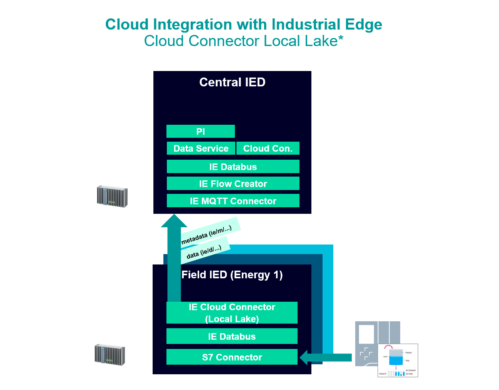

# Decentralized data forwarding to a higher-level device 

This example shows how to use the Data Service Custom Adapter 

- [Data Service Custom Adapter ](#custom-adapter)
    - [Overview](#overview)
    - [General task](#general-task)
    - [Prerequisities](#prerequisities)
    - [Used components](#used-components)
  - [Documentation](#documentation)
  - [Contribution](#contribution)
  - [Licence and Legal Information](#licence-and-legal-information)

### Overview

### General task

The idea is to send the data centrally to a higher-level edge device from the field level. 
For this purpose, one (or more) edge devices are integrated into the plant network and used to forward data to the central Edge Device. 
In the central device, the data is stored  using Data Service and analyzed with Performance Insight. 

###  Prerequisities
- Establish Connection to one PLC for getting data into the Edge Device
- Access to an Industrial Edge Management System (IEM)
- Installed Apps on central Device Performance Insight, MQTT Connector, Databus, Data Service
- Installed Apps Energy Device 1 S7 Connector, Cloud Connector, Databus
- Google Chrome (Version ≥ 72) or Firefox (Version ≥ 62)

### Used components

- Industrial Edge Management V1.2.0-34
- IE Databus Configurator V1.2.23
- IE Databus V1.2.18
- SIMATIC S7 Connector V1.2.29
- MQTT Connector V1.2.9
- Cloud Connector V1.2.4
- Data Service V1.2.0
- IE Flow Creator V1.1.2
- Performance Insight V1.2.0
- Industrial Edge Device V1.2.0-56
- Web browser (Mozilla or Chrome)

## Configuration Central Edge Device

You can find the further information about the following steps in the [docs](docs/Installation.md)
- Install Data Service, Databus, MQTT Connector, IE Flow Creator, Performance Insight

## Configuration Energy Device 1

You can find the further information about the following steps in the [docs](docs/Installation.md)
- Install S7 Connector, IE Databus, IE Cloud Connector 

## Documentation

You can find further documentation and help in the following links
  - [Industrial Edge Hub](https://iehub.eu1.edge.siemens.cloud/#/documentation)
  - [Industrial Edge Forum](https://www.siemens.com/industrial-edge-forum)
  - [Industrial Edge landing page](https://new.siemens.com/global/en/products/automation/topic-areas/industrial-edge/simatic-edge.html)
  
## Contribution

Thanks for your interest in contributing. Anybody is free to report bugs, unclear documenation, and other problems regarding this repository in the Issues section or, even better, is free to propose any changes to this repository using Merge Requests.

## Licence and Legal Information

Please read the [Legal information](LICENSE.md).

