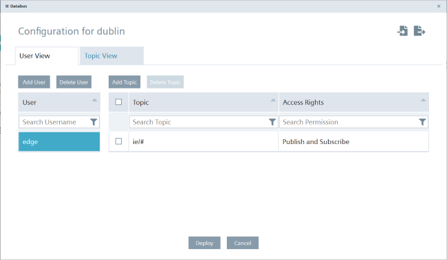

# Configuration

- [Configuration](#configuration)
    - [Configure Databus](#configure-databus)
    - [Configure S7 Connector](#configure-s7connector)
    - [Configure Cloud Connector ](#configure-cloudconnector)
      - [Configure Device 1 & 2](#configure-cloudconnector-send-data)
      - [Configure Central Device](#configure-central-get-data)
    - [Configure IE-Flow Creator](#ie-flow-creator)
   
# Configuration Device Energy 1 and Energy 2 

### Configure Databus

In your IEM open the Databus and launch the configurator.

Add a user with this topic:
`"ie/#"`

Deploy the configuration.

### Configure S7 Connector

Add your Tags(graphics/add_tag.PNG) 

Click on the right corner Settings and add your Databus credentials(graphics/add_credentials.PNG)

Afterwards you can deploy and start the project(graphics/workflow_project.PNG)

### Configure Cloud Connector 

Add a Topics in the Bus Adapter

Create one Route

Add Cloud Connector Client by using Local Lake as an option

Under Hostname type the IP-Adress of your Central Device

Port Number is 9883 

Switch to the tab "Advanced" and configure your Publish Topic

Configuration of Cloud Connector for Device 1 and Device 2 

(graphics/flow_creator.PNG)

## Configuration Central Device 

### Configure Databus

### 

### Configure IE MQTT Connector

### Import and Configure IE Flow Creator

### Configure Data Service

