# Configuration

- [Installation](#installation)
    - [Configure PLC project](#configure-plc-project)
    - [Configuration Device Energy 1 & 2](#configuration-device-energy-1-and-energy-2)
    - [Configuration Central Device](#configuration-central-device)
        - [IE MQTT Connector](#mqtt-connector)
        - [Configure IE-Flow Creator](#ie-flow-creator)
        - [Data Service Custom Adapter](#dataservice-custom-adapter)
        - [Performance Insight](#performance-insight-dashboard)
   
## Configure PLC project

1) Open TIA portal and open the project containing the filling application
2) Download the PLC program to the PLC and set the PLC into RUN
3) Open the HMI to control the filling application   
   
## Configuration Device Energy 1 and Energy 2 

To read data from the PLC and provide the data, we will use S7 Connector to establish connection with the PLC via OPC UA.
The S7 Connector sends the data to the Databus, where the Data Service app can collect what is needed for the notification rules.
In order to build this infrastructure, these apps must be configured properly:

- IE Databus
- S7 Connector
- Cloud Connector

**IE Databus**

- Launch the IE Databus Configurator and add your related credentials/topics:
`"ie/#"`

**S7 Connector**

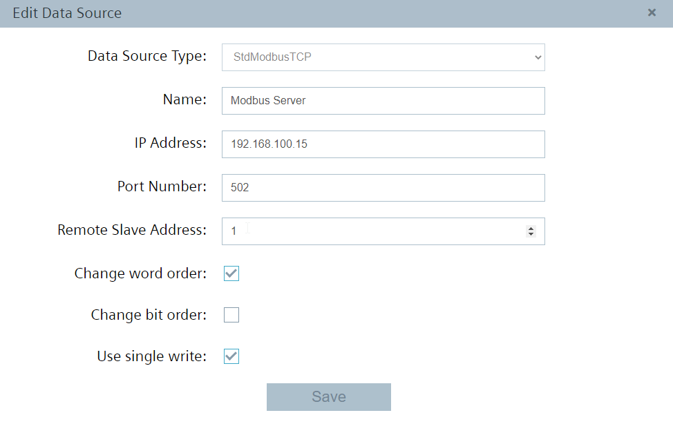

- Launch the S7 Connector and configure the PLC connection 
- Start and Deploy your S7 Connector configuration

**Cloud Connector Local Lake**

- Configure starting from the left side "Bus Adaptor" to the right the "Cloud Connector Clients"
- To deploy the configuration, initially click on your route and connect your topics from the bus adaptor with your cloud topics 
- Then click on deploy. 
- Note: You must create one topic for the data and one topic for the metadata. 

1:
ie/d/j/simatic/v1/s7c1/dp/r/EnergyMeter/default
ie/m/j/simatic/v1/s7c1/dp/r/EnergyMeter/
Add a topic in the Bus Adaptor 

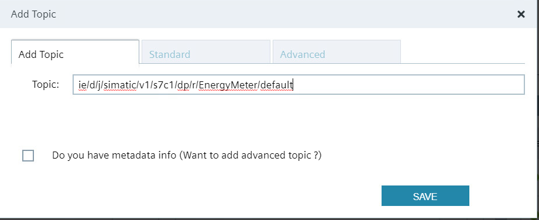

2:
Close the option and prove under "Edit configuration" the following settings: 

3: 
Bus Adaptor Configuration

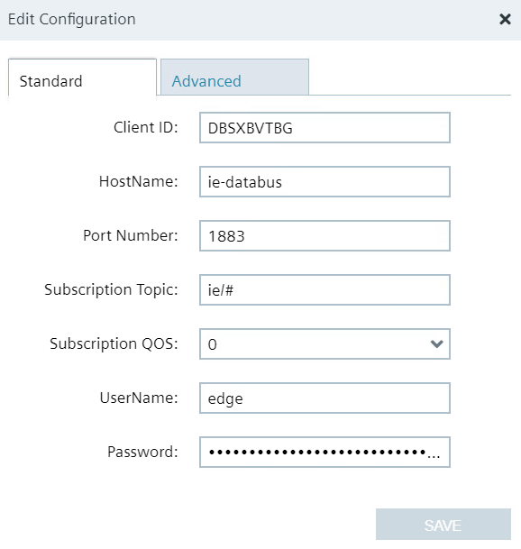

- Same procedure for the metadata topic

4:
Create for the data a Route

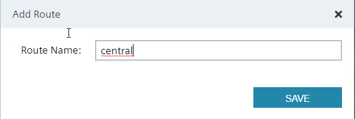

5:
Create for the metadata a Route

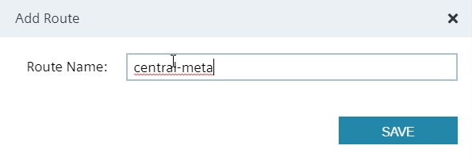

Add a Cloud Connector Clients by using Local lake as Type
 
6: 
Client Connection Local Lake

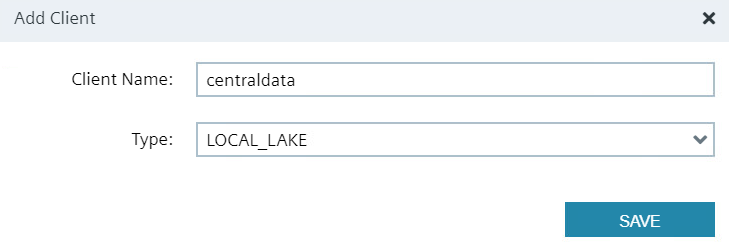

- For receiving data on our central edge device we use the MQTT Connector, which is accessible via port 9883

7: 
Add external databus from Central Device

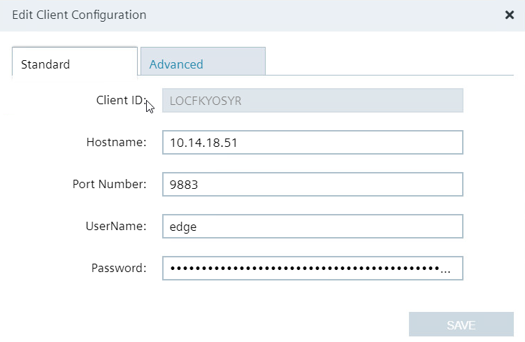

Adjust the Publish Topic

8: Create Publish Topic

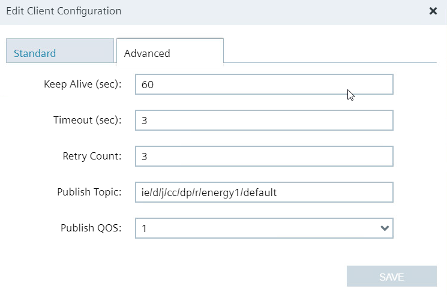

- Same steps for the metadata topic

9:
Overview of the Cloud Connector configuration

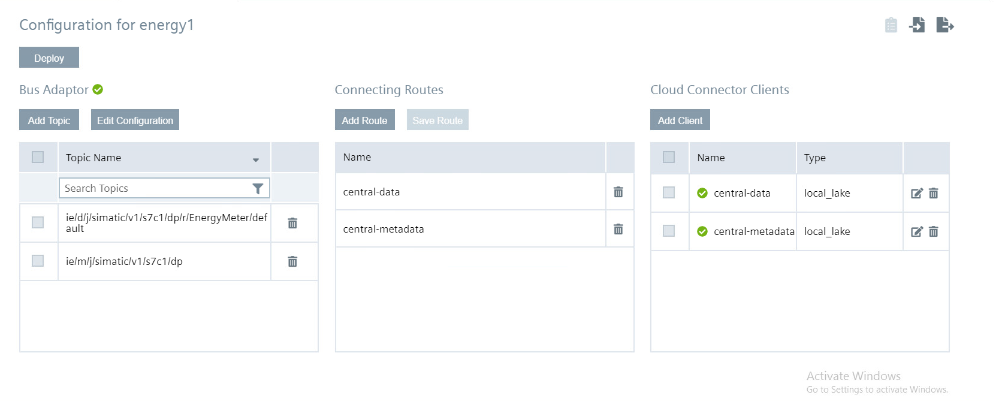

## Configuration Central Device 

The following applications must be installed and configured on the central edge device

- IE Databus
- IE MQTT Connector
- IE Flow Creator
- Data Service
- Performance Insight

**Configure Databus**

Add your user credentials and publish topic

**Configure IE MQTT Connector**

In the Databus Configurator switch to "IE MQTT" Connector and enable the external databus by clicking unsecure

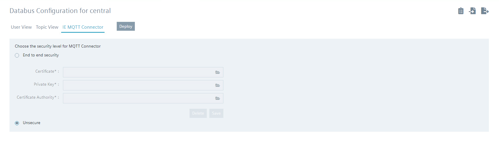

**IE Flow Creator**

Purpose of the Flow: The incoming data from the two Edge devices must be converted into the appropriate format so that the data service is able to process the data. 

Open the IE Flow Creator App from the IED Web UI and import the [convertdata.json](src/convertdata.json)

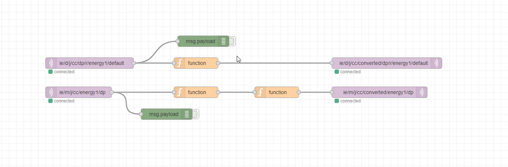

**Data Service**

- We get data from 2 different devices. In the data service we create a custom adapter for each device. 
- Important here is to create the appropriate metadata topic.
- The connection status changes automatically to green if its correctly configured. 

Create your custom Adapter for Edge Device Energy 1

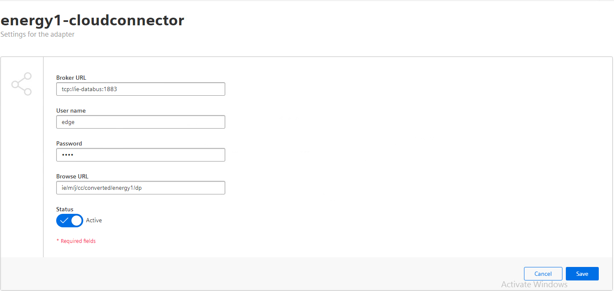

Create your custom Adapter for Edge Device Energy 2

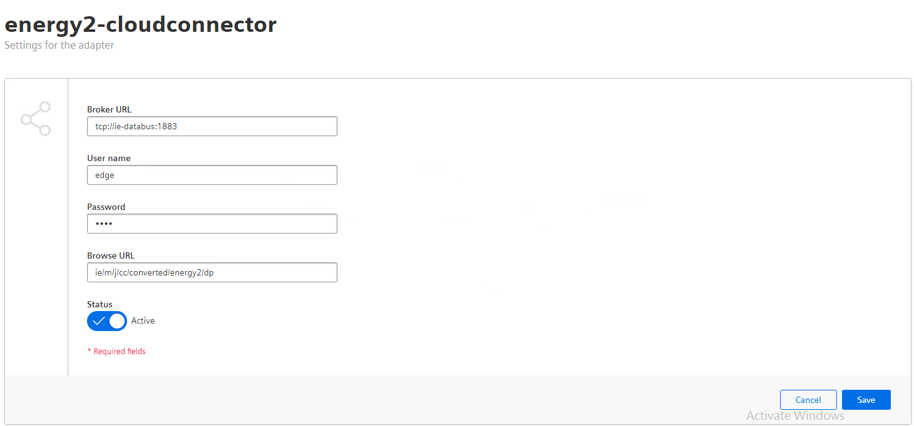

Save the connection and return to the main page

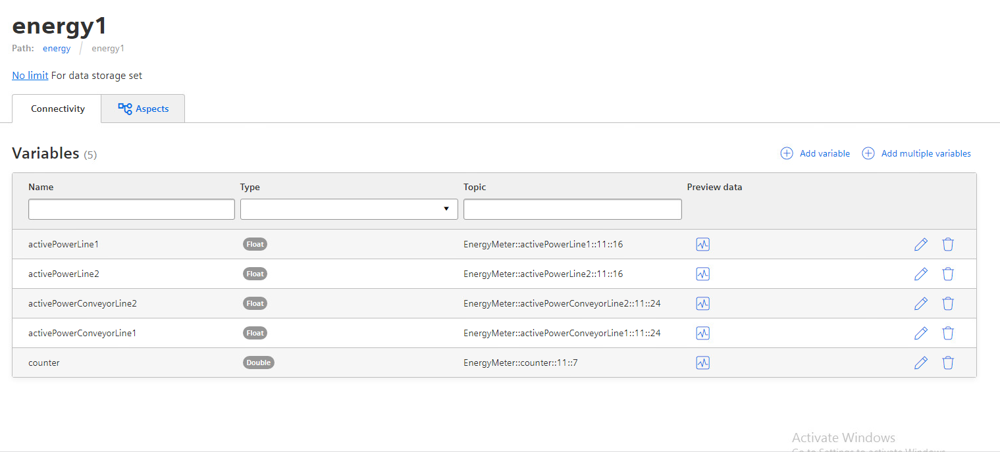

Check the datatransfer with preview data

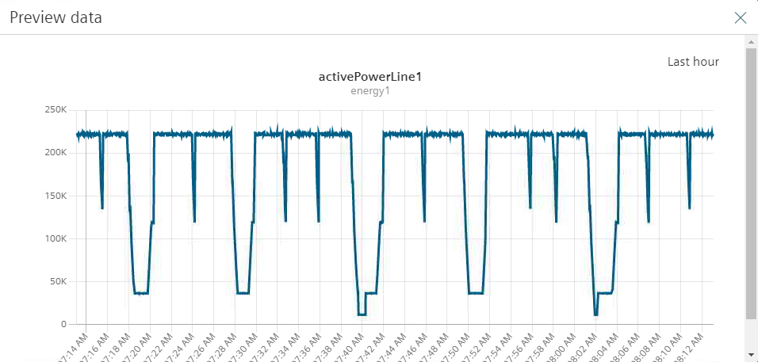

**Performance Insight**

The same Asset structure is visible in Performance Insight
Finish the example by creating your Dashboard

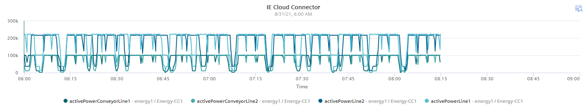

