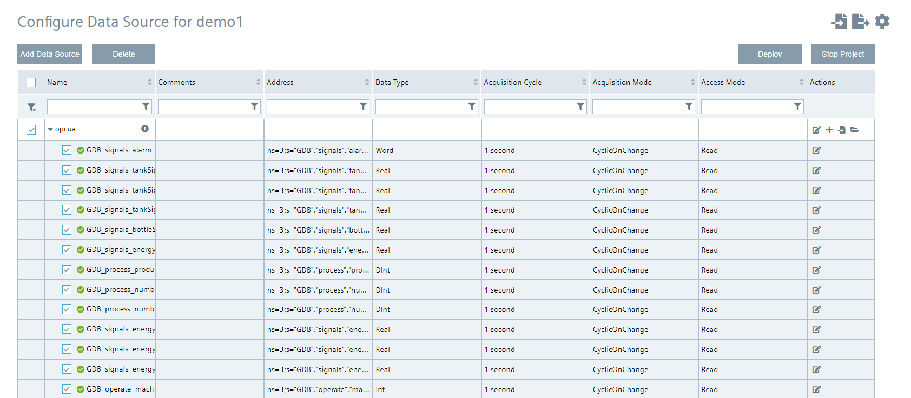
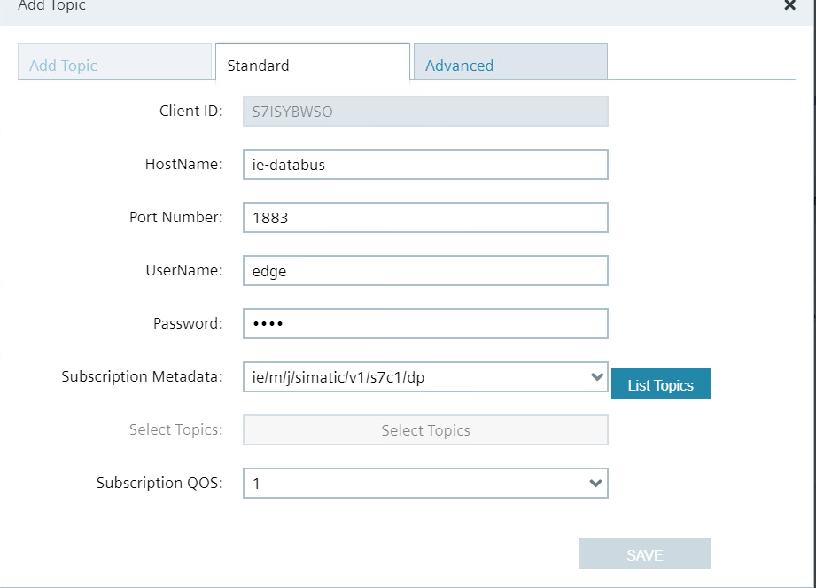
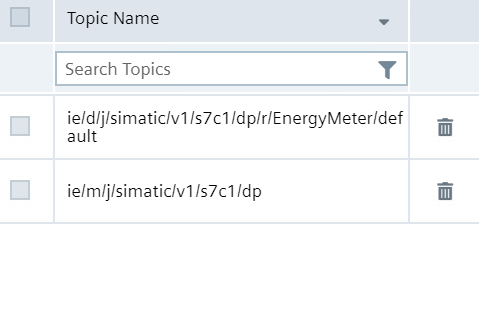

# Configuration

- [Installation](#installation)
    - [Configure PLC project](#configure-plc-project)
    - [Configuration Device Energy 1](#configuration-device-energy-1)
    - [Configuration Central Device](#configuration-central-device)
        - [IE MQTT Connector](#mqtt-connector)
        - [Configure IE-Flow Creator](#ie-flow-creator)
        - [Data Service Custom Adapter](#dataservice-custom-adapter)
        - [Performance Insight](#performance-insight-dashboard)
   
## Configure PLC project

1) Open TIA portal and open the project containing the filling application
2) Download the PLC program to the PLC and set the PLC into RUN
3) Open the HMI to control the filling application   
   
## Configuration Device Energy 1

In the next steps is described how to configure the devices which are required for sending data. 
Remark: The screenshots contain the configuration for device 1.

- IE Databus
- S7 Connector
- Cloud Connector

**IE Databus**

- Launch the IE Databus Configurator and add your related credentials/topics:
`"ie/#"`

**S7 Connector**

Launch the S7 Connector and configure the PLC connection 
Start and Deploy your S7 Connector configuration

**Cloud Connector Local Lake**

Configure starting from the left side "Bus Adaptor" to the right the "Cloud Connector Clients"
To deploy the configuration, initially click on your route and connect your topics from the bus adaptor with your cloud topics 
Then click on deploy. 
Note: You must create one topic for the data and one topic for the metadata. 

1:
Add the Topics in the Bus Adaptor Field
One for the data and one for the metadata

'"ie/d/j/simatic/v1/s7c1/dp/r/EnergyMeter/default"'

'"ie/m/j/simatic/v1/s7c1/dp"'

2:
Go to the standard tab and add your databus credentials (user, passwort and port)

3:
At least you need two entries in the Bus Adpater

4:
Create for the data a Route

5:
Create for the metadata a Route

 
6: 
Client Connection Local Lake
Select Local Lake

For receiving data on our central edge device we use the MQTT Connector, which is accessible via port 9883

7: 
Add external databus from Central Device

8: Create Publish Topics

'"ie/d/j/cc/dp/r/energy1/default"'
'"ie/m/j/cc/energy1/dp"'

9:
Overview of the Cloud Connector configuration

## Configuration Central Device 

The following applications must be installed and configured on the central edge device

- IE Databus
- IE MQTT Connector
- IE Flow Creator
- Data Service
- Performance Insight

**Configure Databus**

Data concentrator for field level devices for displaying factory process data using performance insight

Add your user credentials and publish topic

**Configure IE MQTT Connector**

In the Databus Configurator switch to "IE MQTT" Connector and enable the external databus by clicking unsecure

**IE Flow Creator**

Purpose of the Flow: The incoming data from the two Edge devices must be converted into the appropriate format so that the data service is able to process the data. 

Open the IE Flow Creator App from the IED Web UI and import the [convertdata.json](https://github.com/industrial-edge/data-service-custom-adapter/tree/main/src/convertdata.json)

**Data Service**

- We get data from 2 different devices. In the data service we create a custom adapter for each device. 
- Important here is to create the appropriate metadata topic.
- The connection status changes automatically to green if its correctly configured. 

Create your custom Adapter for Edge Device Energy 1

Create your custom Adapter for Edge Device Energy 2

Save the connection and return to the main page

Check the datatransfer with preview data

**Performance Insight**

The same Asset structure is visible in Performance Insight
Finish the example by creating your Dashboard

